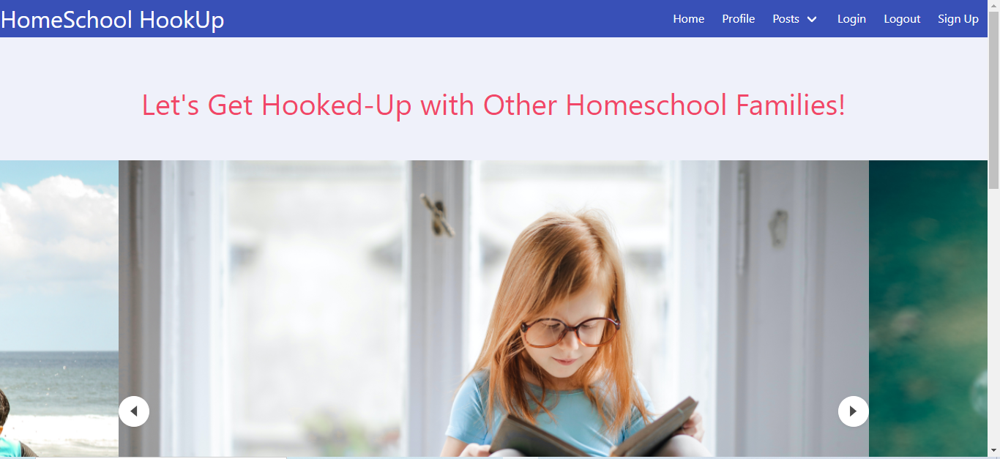
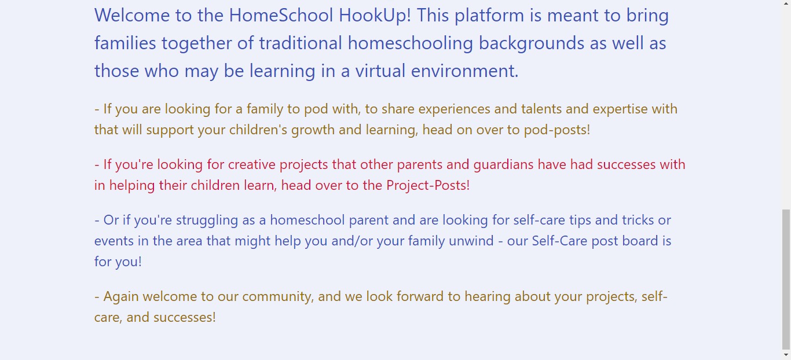
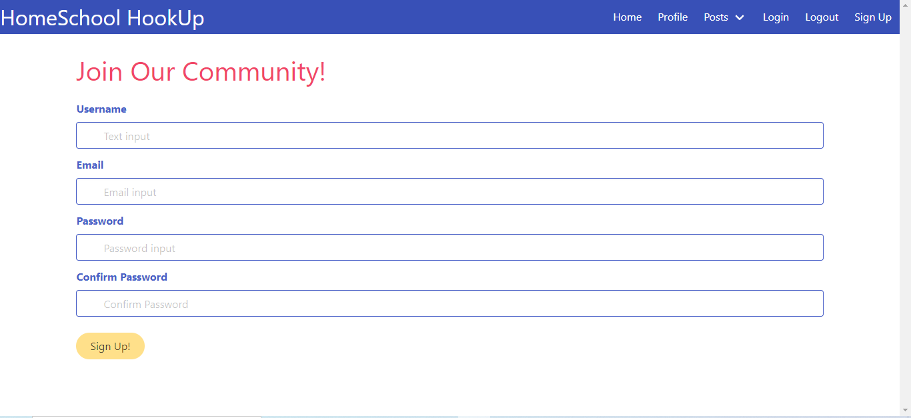
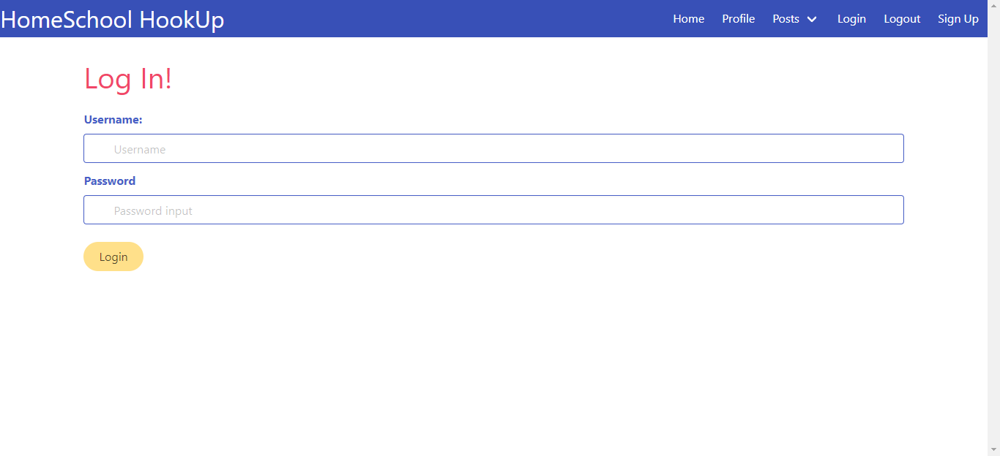
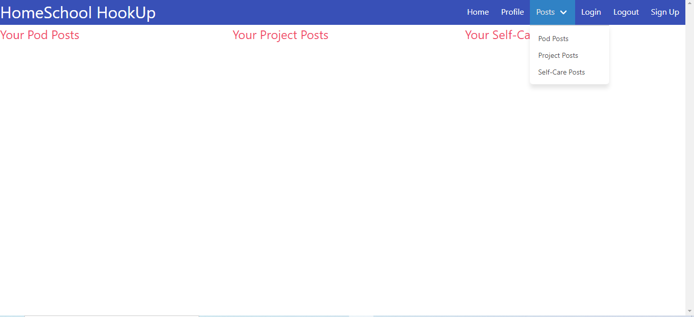
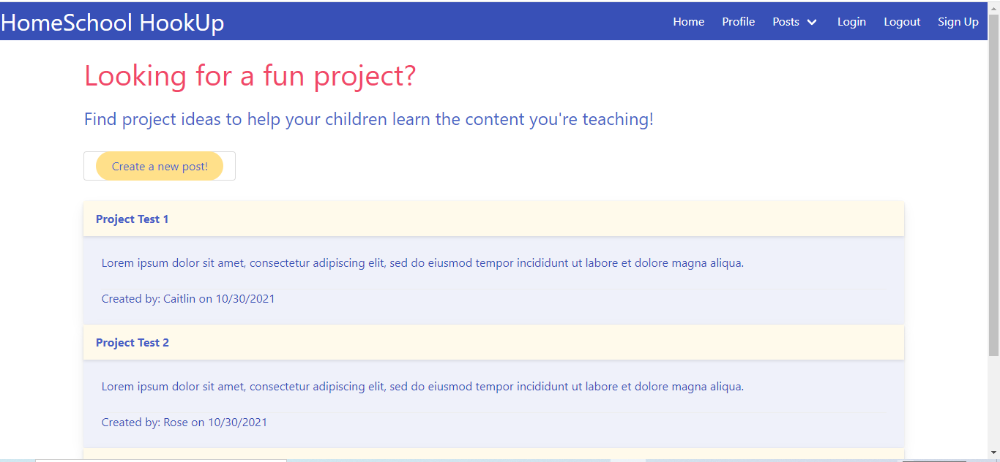
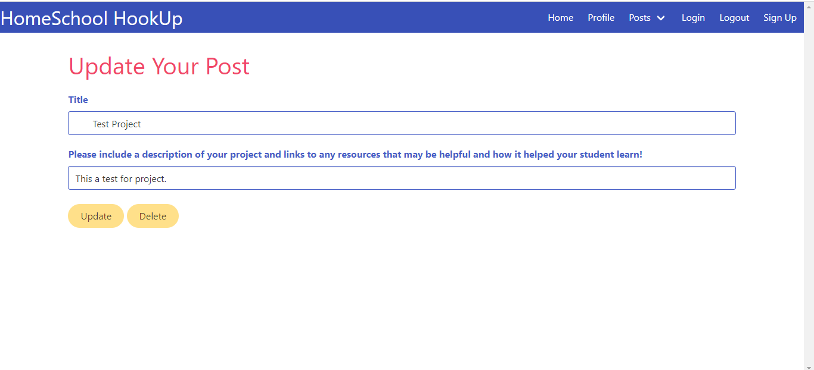

# HomeSchool_HookUp

"Homeschool Hookup” is an application that connects the students and parents of a certain radius to create a social pod that’s tailored to the needs of the students and the parents.

## Task

With our team, we conceive and execute a design that solves a real-world problem. In creating our first collaborative full-stack application, we combine a robust back end--with servers, databases, advanced APIs, and user authentication—-to an intuitive front end. We continue to build on the agile development methodologies we’ve used throughout this course, like storing our project code in GitHub, managing our work with a project management tool, and implementing feature and bug fixes using the Git branch workflow and pull requests.

## User Story

 As a parent of school-age children, I need an app that helps me connect with other families and resources like pod, projects and self care  so that my student has optimal social and learning opportunities outside of a traditional school setting.

## Description

 

 This is a full-stack web application. Our team design and build an application using the MVC paradigm, with own server-side API, added user authentication and connect it to a database.

```md
 GIVEN a HomeSchool-HookUp web application
 WHEN I click the Home section
 THEN I am presented with a beautiful carousel of pictures of students , description about app and navbar with different links
 WHEN I click on Signup
 THEN I am presented with signup form
 WHEN I click on Login 
 THEN I am presented with Login form
 WHEN I go to Post 
 THEN it show drop down list with Pod, Project and Self Care option
 WHEN I click on Pod, Project, Self Care
 THEN I am presented with a relative page with existing pods, projects or Self Care posts.
 WHEN I create new pod, project or self care post
 THEN I can see that on relative page
 WHEN I select title of pod, project or self care post
 THEN I am presented with a page with edit option for related posts
 WHEN I clicked update or delete 
 THEN I am able to update or delete posts
 WHEN I clicked profile
 THEN I am presented with profile page
 WHEN I clicked logout
 THEN I am redirected to homepage
 ```

## Screen-Shots















## Key Topics

The following topics will be covered in this project:

* Full-stack applications

* [Git branching workflow](https://git-scm.com/book/en/v2/Git-Branching-Branching-Workflows)

* [Agile software development](https://en.wikipedia.org/wiki/Agile_software_development)

* Collaborative development

## In this Project 

* We use Node.js and Express.js to create a RESTful API.

* We use Handlebars.js as the template engine.

* We use MySQL and the Sequelize ORM for the database.

* Have both GET and POST routes for retrieving and adding new data. 
  As well PUT and DELETE routes for update abd delete data.

* We use one new technology, package Bulma CSS Framework that we haven’t work with in BootCamp class.

* Have a folder structure that meets the MVC paradigm.

* Include authentication (express-session and cookies).

* Protect API keys and sensitive information with environment variables.

* Is deployed using Heroku (with data).

* Have a polished UI.

* Is responsive.

* Is interactive. 

## Table Of Contents

- [Installation](#installation)
- [Usage](#usage)
- [Test](#test)
- [License](#license)
- [Contribution](#contribution)
- [Contact](#contact)
- [Questions](#questions)
    
## Installation 

The following necessary dependencies must be installed to run the application.

  ```md
   node.js, express.js, express-handlebars, mysql2, sequelize, bcrypt, bulma, bulma-carousel, dotenv, express-session and connect-session-sequelize
   ```

## Usage

 An user can invoked the application with node server.js or nodemon server.js (you need to install nodemon as dev dependencies first)command in terminal, or an user can visit deployed web application.

## Test
  N/A

## License

This project is licensed under :

 [MIT](https://opensource.org/licenses/MIT)

For more information about the license, check the above link.

## Contribution

Caitlin Wall, Rose Luu, Bryanna Vinge and Bindubahen Vaghela

## Contact

* GitHub :[Homeschool-Hookup](https://github.com/Homeschool-Hookup)

* Email : caitlinwall96@gmail.com, 
          luuhongnhung10@gmail.com,
          bevinge711@gmail.com, 
          bindi.vaghela@gmail.com
    
## Questions

If you have any questions, please reach out to our Github,

* [Homeschool-Hookup](https://github.com/Homeschool-Hookup)

## Presentation Link

* [PowerPoint Presentation](https://docs.google.com/presentation/d/1HZMUus7v0lnBxk-RvF6nIwsYdlGleCJsVJtFXbDlO-E/edit?usp=sharing)

## Deployed Link

* [The URL of the deployed application]()

* [The URL of the GitHub repository](https://github.com/Homeschool-Hookup/HomeSchool_HookUp)

#### Thank you for visiting our Github!
